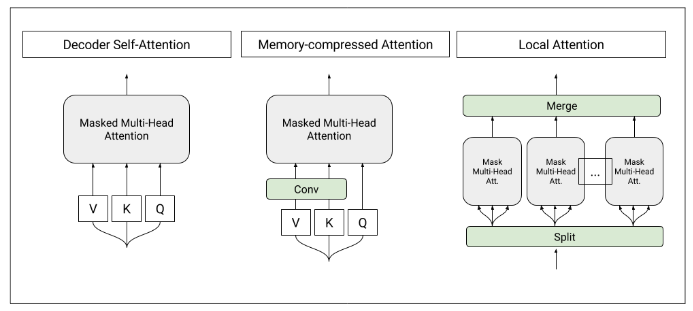

</img>

## Memory Compressed Attention

Implementation of the Self-Attention layer of the proposed <a href="https://arxiv.org/abs/1801.10198">Memory-Compressed Attention</a>, in Pytorch. This repository offers both the causal and non-causal variant, and will take care of the padding if the sequence length is not divisible by the compression ratio.

The code also resolves an edge-case where the very first query have no keys to attend to in the auto-regressive scenario. The solution is to use null key/values, appended to the final compressed set, so that there is always at least 1 key for all queries to attend to.

## Install

```bash
$ pip install memory_compressed_attention
```

## Usage

```python
import torch
from memory_compressed_attention import MemoryCompressedAttention

attn = MemoryCompressedAttention(
    dim = 512,
    heads = 8,                 # number of heads
    causal = False,            # auto-regressive or not
    compression_factor = 3,    # compression ratio
    dropout = 0.1              # dropout post-attention
)

x = torch.randn(1, 1024, 512)
mask = torch.ones(1, 1024).bool()

attn(x, input_mask = mask) # (1, 1024, 512)
```

## Citations

```bibtex
@misc{liu2018generating,
    title={Generating Wikipedia by Summarizing Long Sequences},
    author={Peter J. Liu and Mohammad Saleh and Etienne Pot and Ben Goodrich and Ryan Sepassi and Lukasz Kaiser and Noam Shazeer},
    year={2018},
    eprint={1801.10198},
    archivePrefix={arXiv},
    primaryClass={cs.CL}
}
```
